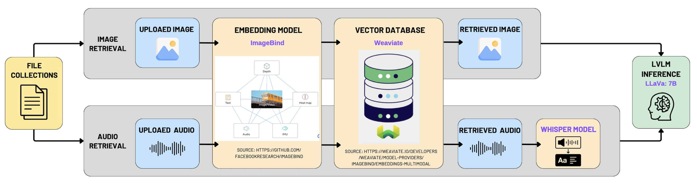
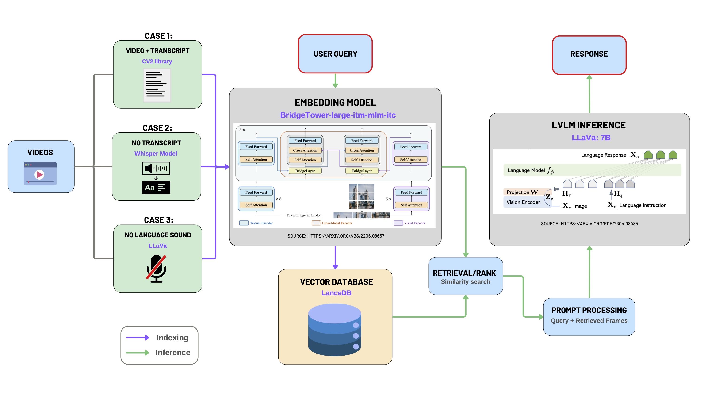
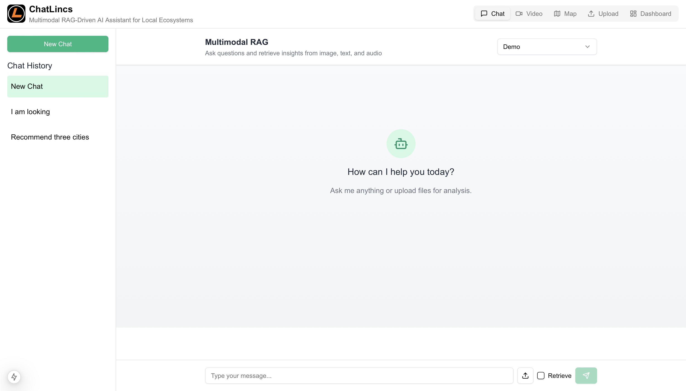
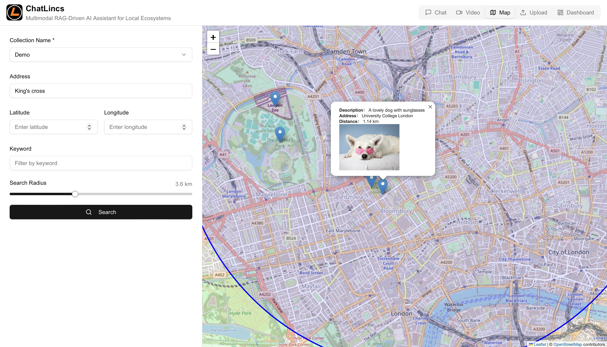

# 🌍 ChatLincs: Multimodal RAG Platform

**Team 12** **–** **NTT Data – Monitoring and Engagement Tracking for Impact Reports**

---

## 📖 Overview

**ChatLincs** is an advanced multimodal Retrieval-Augmented Generation (RAG) platform designed to facilitate comprehensive environmental monitoring and enhance local community engagement. Integrating state-of-the-art AI technologies, ChatLincs empowers users to interact seamlessly with multimodal data (images, audio, text, videos), efficiently manage tasks, and visualize geospatial information.


---

## 📖 Table of Contents

1. [Features](#-features)
2. [Project Overview](#-project-overview)
   - [Backend Architecture](#backend-architecture)
   - [Backend Architecture Diagram](#backend-architecture-diagram)
   - [Frontend Overview](#frontend-overview)
3. [Technology Stack](#-technology-stack)
4. [Setup Instructions](#-setup-instructions)
   - [Prerequisites](#-prerequisites)
   - [Backend Setup](#-backend-setup)
   - [Frontend Setup](#-frontend-setup)
5. [How to Run](#-how-to-run)
6. [Docker Deployment](#-docker-deployment)
7. [User Manual](#-user-manual)
8. [Troubleshooting & FAQs](#-troubleshooting--faqs)
9. [Contributors](#-contributors)

## 🌟 Features 

- **Multimodal RAG**: AI-driven insights from images, text, and audio.
- **Video Interaction**: AI-supported queries and discussions about video content.
- **Geographic Map View**: Interactive map visualization of stored data.
- **Task Management (Kanban Board)**: Prioritize tasks, assign categories, and track progress intuitively.
- **Multimedia Data Upload**: Easily upload and manage multimedia resources.

---

## 🚀 Project Overview

### Backend Architecture

The backend consists of:

- **Flask API**: Manages API endpoints and orchestrates backend processes.
- **Weaviate & LanceDB (Vector Database)**: Enables efficient multimodal semantic search.
- **Multi2Vec-Bind (ImageBind) & BridgeTower**: Converts multimodal data into embeddings.
- **Ollama (LLaVA 7B)**: Provides fast multimodal inference capabilities.

### **Backend Architecture Diagram**: 

**Multimodal RAG**:



**Video RAG**:


### Frontend Overview

The frontend delivers a user-friendly experience through:

- **Interactive Dashboards**: Visualizations summarizing engagement and environmental data.
- **Multimodal Data Queries**: Easily upload and query multimedia content.
- **Real-time Data Interaction**: Live updates as backend processes data.

**Frontend Interface**:  


## 🛠 Technology Stack

### Frontend

- **Framework**: Next.js (React)
- **Languages**: TypeScript
- **Styling**: shadcn/ui

### Backend

- **Framework**: Flask
- **Language**: Python
- **Vector Database**: Weaviate & LanceDB
- **Embedding model**: ImageBind & BridgeTower
- **Multimodal LLM**: LLaVA 7B

### 🐳 Containerization & Deployment

- **Docker**, Docker Compose, Conda

---

## 🛠 Setup Instructions

### 📌 Prerequisites

Install the following tools:

- [Conda](https://docs.conda.io/)
- [Docker & Docker Compose](https://docs.docker.com/get-docker/)
- [Node.js (v18+)](https://nodejs.org/)
- npm (bundled with Node.js)

### 📦 Backend Setup

Clone repository and set up environment:

```bash
git clone https://github.com/Hao-Hao211/ChatLincs.git
cd ChatLincs
conda env create -f chatlincs.yml
conda activate chatlincs
```

Launch Docker services:

```bash
cd backend/app
docker compose up -d
```

### 🌐 Frontend Setup

Install dependencies:

```bash
cd ChatLincs/frontend
npm install --legacy-peer-deps
```

---

## 🚀 How to Run

### Backend (Flask)

Run Flask server:

```bash
cd backend
python run.py
```

Backend API at: [http://localhost:5000](http://localhost:5000)

### Frontend (Next.js)

Launch frontend server:

```bash
cd frontend
npm run dev
```

Frontend at: [http://localhost:3000](http://localhost:3000)

---

## 🐳 Docker Deployment

 `docker-compose.yml`:

```yaml
---
version: '3.4'
services:
  weaviate:
    command:
    - --host
    - 0.0.0.0
    - --port
    - '8080'
    - --scheme
    - http
    image: semitechnologies/weaviate:1.23.7
    ports:
    - 8080:8080
    - 50051:50051
    restart: on-failure:0
    depends_on:
      multi2vec-bind:
        condition: service_healthy    
    environment:
      QUERY_DEFAULTS_LIMIT: 25
      AUTHENTICATION_ANONYMOUS_ACCESS_ENABLED: 'true'
      PERSISTENCE_DATA_PATH: '/var/lib/weaviate'
      DEFAULT_VECTORIZER_MODULE: 'multi2vec-bind'
      ENABLE_MODULES: 'multi2vec-bind'
      BIND_INFERENCE_API: 'http://multi2vec-bind:8080'
      CLUSTER_HOSTNAME: 'node1'
  
  multi2vec-bind:
    image: semitechnologies/multi2vec-bind:imagebind
    environment:
      ENABLE_CUDA: '0'
    healthcheck:
      test: wget --no-verbose --tries=3 --spider http://localhost:8080/.well-known/ready || exit 1
      interval: 10s
      retries: 5
      start_period: 15s
      timeout: 3000s

  ollama:
    image: ollama/ollama:latest
    ports:
      - "11434:11434"
    volumes:
      - ./ollama-models:/root/.ollama
    environment:
      OLLAMA_MODELS: "llava:7b"
    restart: always
```

---

## 💻 User Manual

### 1. 📁 **Upload Data**

To upload multimedia data:

- Click **"Upload"** in the top-right menu.
- Enter the following details:
  - **Collection Name:** A logical grouping for related data (like a folder).
  - **Description:** Briefly describe the content (e.g., "A lovely dog").
  - **Location:** Provide either an address (e.g., "London Zoo") for automatic geocoding or exact latitude/longitude coordinates.
- Drag and drop files directly into the upload area or click to browse files from your computer.

**Example:**  

We upload an image titled "A lovely dog with sunglasses," locate it at "University College London," and store it in the collection named "Demo."

- Uploaded: Image of "A lovely dog with sunglasses".  

- Location: "University College London".  

- Collection: "Demo".

  

  

  *(Uploaded files from different sources can be stored in the same collection to enrich your dataset.)*

---

### 2. 🌍 **Map View**

To visualize your uploaded data geographically:

- Click **"Map"** in the top-right menu.
- Enter search details:
  - **Collection Name:** Select the collection you wish to visualize.
  - **Central Location:** Enter an address (auto-geocoded, e.g., "London Zoo") or exact coordinates.
  - **Keywords (Optional):** Specify keywords (e.g., "cat" or "dog") to filter displayed results.
  - **Search Radius:** Define the geographical range (e.g., within 4 km).

**Example:**  

We search within 3.6 km around "King’s Cross" station in the "Demo" collection. The map displays our previously uploaded dog image at "University College London," approximately 1.14 km away.

- Center: "King’s Cross", Radius: 3.6 km, Collection: "Demo".  

- Result: Dog image at "University College London", 1.14 km away.

  

---

### ✅ Task Management (Kanban Interface)

Efficiently organize tasks:

Efficiently organize and prioritize your tasks:

- Click **"Dashboard"** from the top-right menu.

- Click **"Add New Task"** in the top-right corner.
- Enter task details:
  - **Title**
  - **Description**
  - **Priority** (e.g., High, Medium, Low)
  - **Category** (customizable tags)
  - **Due Date**
  - **Assignee**

- Tasks appear in **Todo**, **In Progress**, **Done** columns.  
- Easily **Drag-and-Drop** to update statuses, mark tasks complete (via checkbox), edit details or delete.

**Example:**  

We create a task titled "Lost dog in Regent's Park" with the description "A white dog with a smile is lost."


- Task: "Lost dog in Regent's Park".  

- Description: "A white dog with smile is lost".

  

---

### 4. 💬 **Multimodal RAG **

Engage in advanced retrieval-augmented conversations:

- Click **"Chat"** from the top-right menu.

- Enable the **"Retrieve"** feature by checking the "Retrieve" box next to the input field (if unchecked, regular multi-turn LLM conversations are enabled).
- Select your targeted **Collection** from the top-right dropdown menu to specify the search context.

**Example (Text Retrieval):**  
To locate our previously uploaded dog image, we type:

> "I am looking for a dog with sunglasses."

The chatbot accurately retrieves the relevant image and provides a detailed description, such as noting that the sunglasses are "*pink and heart-shaped.*"


**Example (Multimodal Retrieval):**  
You can also upload multimedia files directly into the chat:

- Click the **upload button** on the right of the input box.
- Select an image file and enter your query.

We upload an image of a white puppy and ask:

> "I am looking for this kind of dog."

The chatbot successfully retrieves a visually similar dog from the database and provides relevant details.


---

### 🎬 Chat with Video

- Interact with video content using AI-powered Q&A:

  - Click **"Video"** from the top-right menu.
  - Click **"Upload Video"**.
  - Enter the **YouTube URL** of the video.
  - Optionally adjust the **"Transcript Augmentation"** parameter:
    - This parameter (`n`) enriches the transcript for improved embedding quality by including neighboring subtitle segments around each video frame.  
    - Typically, choose a value ensuring each augmented transcript contains one or two meaningful, self-contained ideas. *Experiment with different values for best results*.
  - For videos **without spoken language** (e.g., nature videos), check the **"No Language Sound"** box.
  - Click to upload. This **may take several minutes** depending on video length and your hardware performance, as it involves processing video frames, generating embeddings, storing data in a vector database, and performing image recognition.


**Example:**  

We upload the YouTube video ["Welcome back to Planet Earth"](https://www.youtube.com/watch?v=7Hcg-rLYwdM), documenting NASA astronauts Douglas Hurley and Robert Behnken’s return aboard SpaceX’s Crew Dragon Endeavour.


While viewing, we forget one astronaut's name. In the chat box, after selecting this video from the top-right dropdown, we ask:

> "What is the name of one of the astronauts?"

The chatbot identifies the astronaut as **Robert Behnken** and provides a relevant video snippet confirming this information.


---

## 🛠 Troubleshooting & FAQs

- **Slow Upload/Processing:** Choose *shorter videos with transcripts.*
- **Location issues:** Use *precise addresses* or coordinates.
- **Docker issues:** View logs (`docker compose logs`).

---

## 👥 Contributors

- **Hao Zhang** (Project Lead, Backend & AI Integration)
- **Jack Liu** (Infrastructure & Deployment, Testing)
- **Vincent Yang** (Frontend, UI/UX)

---

## 📞 Contact & Support

- **Maintainer:**  hao.zhang.22@ucl.ac.uk

---

🌱 **ChatLincs – Transforming Insights and Community Engagement Through Multimodal AI** 🌱
